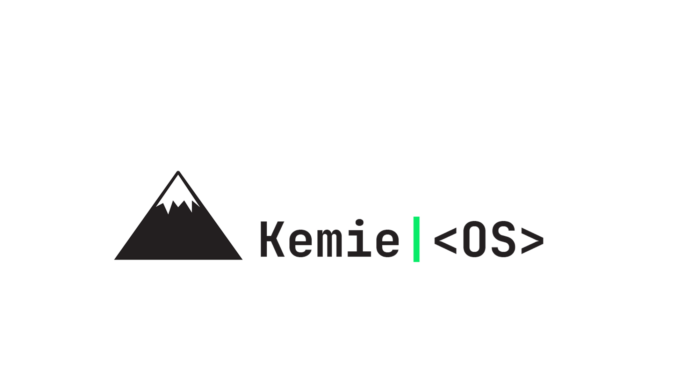

# KemieOS
A simple operating system which implements a UNIX-like kernel. 
> Help make this project something big.

## Run With Qemu
qemu-system-i386 kemieOS.iso

## Info
This repo is an add on to Lucus Darnells book.
Help make Kemie great, we need your skills to boost the production of this project.

## Get Involved 
If you want to help out email me at,
> jacobygill@outlook.com

## What To Expect
Its not much but with hard working and deticated hackers we can make something
of this shell-like Operating System.

